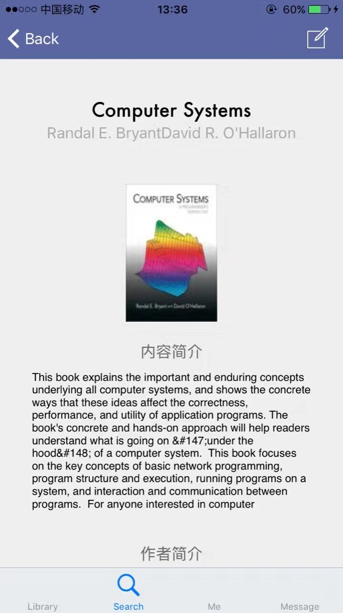
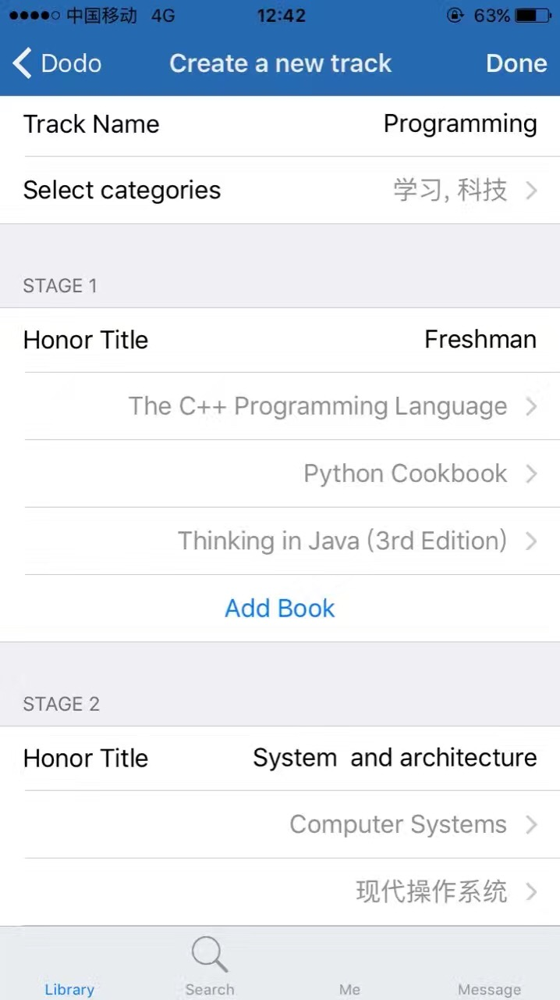
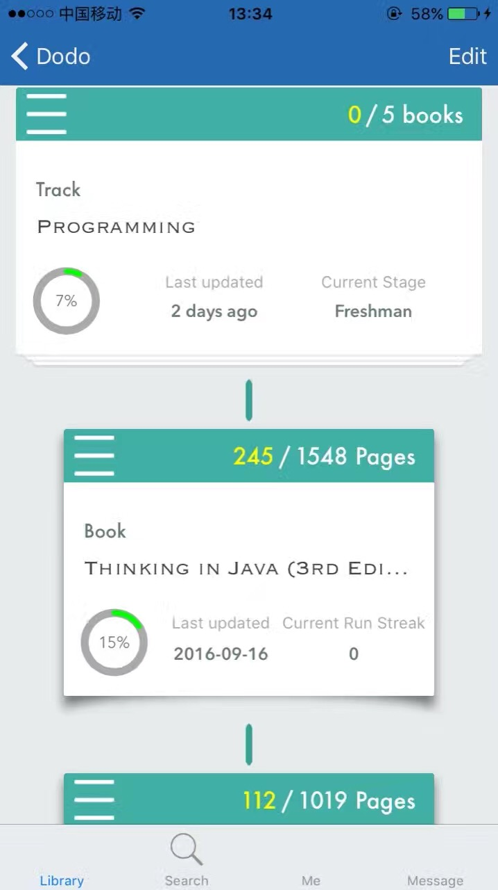
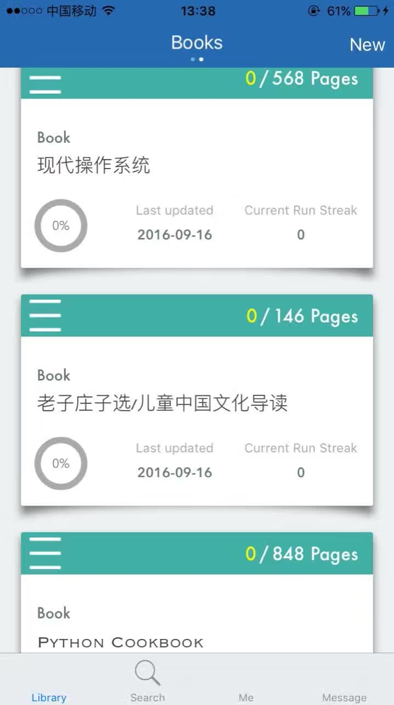
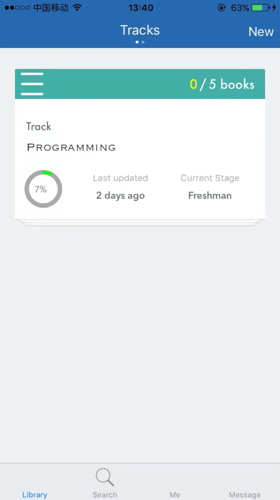

# Dodo
Dodo is an iOS app for scheduling reading progress, featuring on creating tracks of book combinations to learn specific knowledge and achieve goals.

## Demo

## Requirements

* iOS 9.0+
* Xcode 8+
